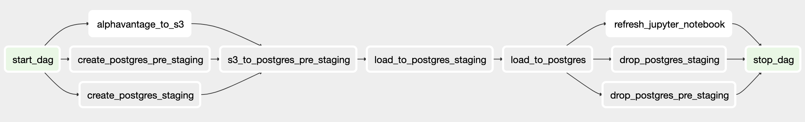

# FX Tracker

A pipeline for exchange rate data built with Airflow, S3, Postgres, Jupyter and Docker

## Overview
<b>Project is WIP</b>

This is a sandbox project to set up an environment with Airflow and Docker in order to schedule and monitor pipelines.

To demonstrate the environment, it is used to fetch daily exchange rate data from an external API (Alpha Vantage), load into S3, load into Postgres including a staging step, then refresh a (currently dummy) Jupyter notebook




<b>Notable features are:</b>
* `docker-compose` to launch Postgres instance and `LocalExecutor` Airflow setup
   * Airflow tasks run on same machine as scheduler
   * Parallelisation of tasks possible
* Custom plugin for Alpha Vantage
  * Custom hook to Alpha Vantage API
  * Custom operator to load data from Alpha Vantage to S3
* `PapermillOperator` used to refresh Jupyter notebook

## Prerequisites
To run this locally, you would need a few things:
* Docker installed
* S3 bucket and access details
* API key for Alpha Vantage [API](https://www.alphavantage.co/support/#api-key) (free)

## Setup

#### Clone respository
```
git clone https://github.com/natasharw/fx-tracker-airflow.git
```

#### Move into new directory
```
cd fx-tracker-airflow
```

#### Generate a fernet key for your environment and pipe into env file
```
echo $(echo "FERNET_KEY='")$(openssl rand -base64 32)$(echo "'") >> airflow.env
```

#### Add Alpha Vantage API key to env file
```
echo "ALPHAVANTAGE_API_KEY='YOUR_KEY_HERE'" >> airflow.env
```

#### Add AWS S3 bucket access details to env file
```
echo "AIRFLOW__CORE__MY_S3_CONN_ID='my-conn-s3://:@:/?aws_access_key_id="_your_aws_access_key_id_"&"aws_secret_access_key"="_your_aws_secret_access_key_"'" >> airflow.env
```

#### Launch docker containers in detached session
```
docker-compose up --build -d
```

#### Initialise database for webserver
```
docker-compose exec webserver airflow initdb
```

## Trigger pipeline
#### Trigger from command line
```
docker-compose exec webserver airflow trigger_dag daily_exchange_rates
```
#### Or trigger from web UI
* Open browser to `http://127.0.0.1:8080/`

## End
#### Close docker session
```
docker-compose down
```
